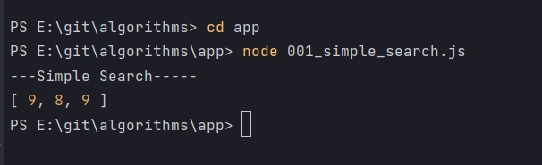

# Поиск

И так рассмотрим простой поиск.

```js
console.log(`---Simple Search-----`);

const simpleSearch = () => {};

```

Функция должна принять структуру данных в которой мы ищем. К примеру мы будем принимать некий list.

```js
console.log(`---Simple Search-----`);

/*list - принимаю структуру данных в которой произвожу поиск*/

const simpleSearch = (list) => {};

```

Вторым параметром указываю то что ищу к примеру search.

```js
console.log(`---Simple Search-----`);

/*list - принимаю структуру данных в которой произвожу поиск*/
/*search - то что ищу может не очень хорошее название*/

const simpleSearch = (list, search) => {};

```

Что нам важно

- условие работы этой функции. 
- Если не нашла элемент будет возвращать просто null.
- если нашла элемент будет возвращать массив из самого элемента, его позиции в массиве т.е. index, количество шагов потраченное на поиск этого элемента.


Создаю переменную в которой будет количество шагов. Так как мы зашли в тело функции мы уже потратили один шаг.

```js
console.log(`---Simple Search-----`);

/*list - принимаю структуру данных в которой произвожу поиск*/
/*search - то что ищу может не очень хорошее название*/

const simpleSearch = (list, search) => {
  let step = 1; /*Количесво шагов*/
};

```

Для того что бы пройтись по массиву можно использовать любой цикл.

```js
console.log(`---Simple Search-----`);

/*list - принимаю структуру данных в которой произвожу поиск*/
/*search - то что ищу может не очень хорошее название*/

const simpleSearch = (list, search) => {
  let step = 1; /*Количесво шагов*/

  for (let i = 0; i < list.length; i++) {}
};

```

Далее я создаю переменную guess т.е. в переводе догадаться. В данную переменную я буду класть текущий элемент итерации. Далее я буду эту переменную сравнивать с тем что у меня находится в search.

```js
console.log(`---Simple Search-----`);

/*list - принимаю структуру данных в которой произвожу поиск*/
/*search - то что ищу может не очень хорошее название*/

const simpleSearch = (list, search) => {
  let step = 1; /*Количесво шагов*/

  for (let i = 0; i < list.length; i++) {
    const guess = list[i]; // складываю текущий элемент итерации. эта переменная на самом деле здесь нафиг не нужна
  }
};

```

Далее делаю сравнение. Если guess равен search. Возвращаю массив состоящий из самого элемента guess, его позиции в списке i или index, и количество шагов step.

```js
console.log(`---Simple Search-----`);

/*list - принимаю структуру данных в которой произвожу поиск*/
/*search - то что ищу может не очень хорошее название*/

const simpleSearch = (list, search) => {
  let step = 1; /*Количесво шагов*/

  for (let i = 0; i < list.length; i++) {
    const guess = list[i]; // складываю текущий элемент итерации. эта переменная на самом деле здесь нафиг не нужна
    if (guess === search) {
      return [guess, i, step];
    } else {
      step++; /*Если не угадали мы переходим на следующий шаг т.е. увеличиваю счетчик шагов +1 тем самым выхожу из тела цикла*/
    }
  }
  /*Если мы прошли весь массив и не нашли наш элемент то возвращаем null*/
  return null;
};

```

Создаю список

```js
console.log(`---Simple Search-----`);

/*list - принимаю структуру данных в которой произвожу поиск*/
/*search - то что ищу может не очень хорошее название*/

const simpleSearch = (list, search) => {
  let step = 1; /*Количесво шагов*/

  for (let i = 0; i < list.length; i++) {
    const guess = list[i]; // складываю текущий элемент итерации. эта переменная на самом деле здесь нафиг не нужна
    if (guess === search) {
      return [guess, i, step];
    } else {
      step++; /*Если не угадали мы переходим на следующий шаг т.е. увеличиваю счетчик шагов +1 тем самым выхожу из тела цикла*/
    }
  }
  /*Если мы прошли весь массив и не нашли наш элемент то возвращаем null*/
  return null;
};

const list = [1, 2, 3, 4, 5, 6, 7, 8, 9];
console.log(simpleSearch(list, 9)); // первый аргумент сам список, второй аргумент то что ищу

```

```shell
node 001_simple_search.js
```




- Вот он находит наш элемент 9.
- Позиция в массиве 8.
- И количество шагов 9

Это так называемая линейная зависимость. Т.е. поиск производится по каждому элементу в массиве.

Теперь рассмотрим на примере большого массива. Для этого я буду использовать генератор массива. Создаю переменную так же list которая принимает массив. В этот массив деструктурирую конструктор массива ...Array(). В него передаю то количество пустых ячеек которые я хочу сгенерировать.

И дадее с помощью функции map() перебираю наши данные. Для этого передаю callback. callback первым параметром ничего не принимат, а вторым передаю i т.е. index. Единственно что index начинается с ноля, а у нас массив начинается с 1. Для этого делаю смещение i +1.

```js
console.log(`---Simple Search-----`);

/*list - принимаю структуру данных в которой произвожу поиск*/
/*search - то что ищу может не очень хорошее название*/

const simpleSearch = (list, search) => {
  let step = 1; /*Количесво шагов*/

  for (let i = 0; i < list.length; i++) {
    const guess = list[i]; // складываю текущий элемент итерации. эта переменная на самом деле здесь нафиг не нужна
    if (guess === search) {
      return [guess, i, step];
    } else {
      step++; /*Если не угадали мы переходим на следующий шаг т.е. увеличиваю счетчик шагов +1 тем самым выхожу из тела цикла*/
    }
  }
  /*Если мы прошли весь массив и не нашли наш элемент то возвращаем null*/
  return null;
};

const list = [...Array(100)].map((_, i) => i + 1);
console.log("list", list);
console.log(simpleSearch(list, 9)); // первый аргумент сам список, второй аргумент то что ищу

```


А теперь попробуем соточку найти.

```js
console.log(`---Simple Search-----`);

/*list - принимаю структуру данных в которой произвожу поиск*/
/*search - то что ищу может не очень хорошее название*/

const simpleSearch = (list, search) => {
  let step = 1; /*Количесво шагов*/

  for (let i = 0; i < list.length; i++) {
    const guess = list[i]; // складываю текущий элемент итерации. эта переменная на самом деле здесь нафиг не нужна
    if (guess === search) {
      return [guess, i, step];
    } else {
      step++; /*Если не угадали мы переходим на следующий шаг т.е. увеличиваю счетчик шагов +1 тем самым выхожу из тела цикла*/
    }
  }
  /*Если мы прошли весь массив и не нашли наш элемент то возвращаем null*/
  return null;
};

const list = [...Array(100)].map((_, i) => i + 1);
console.log("list", list);
console.log(simpleSearch(list, 100)); // первый аргумент сам список, второй аргумент то что ищу

```


