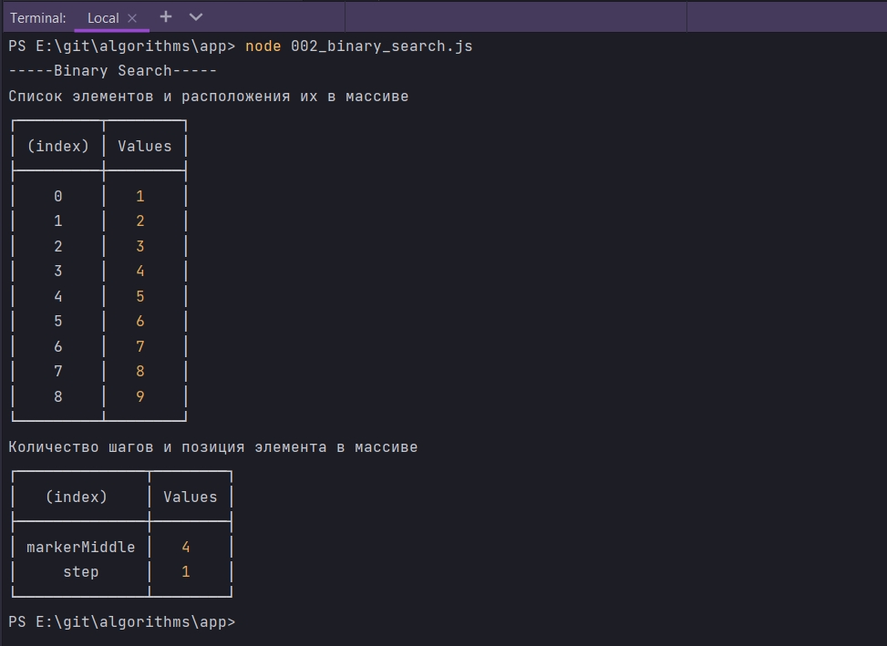
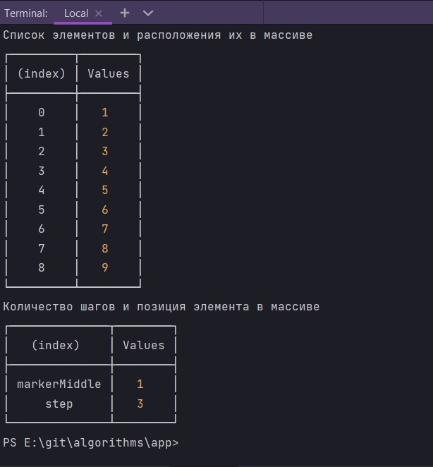
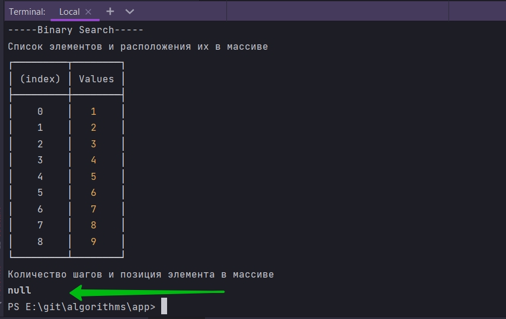
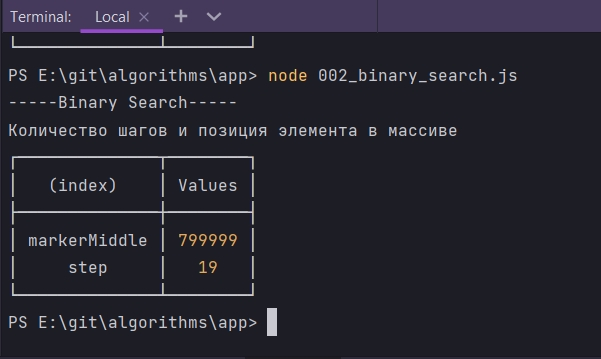

# Бинарный поиск

```js
console.log(`-----Binary Search-----`);

const binarySearch = (list, search) => {};


```

Эта функция будет принимать два параметра

1. Массив list
2. То что мы ищем к примеру search


Если рассматривать прошлый пример, то у нас там было 3 дополнительных переменных. Маркер начала, маркер конца, и маркер середины.

Мы добавим еще переменную которая будет мерить шаги.

```js
console.log(`-----Binary Search-----`);

const binarySearch = (list, search) => {
  const step = 1; /*Количество шагов*/
  let markerStart = 0; // принимает индек массива
  let markerEnd = list.length - 1;
};

```

далее нам нужен цикл. Цикл for тут не проканает. Нам нужен цикл который будет с пост условием. Для этого использую цикл while.

И так в условии я указываю что итерация будет происходить до тех пор пока markerStart меньше либо равен markerEnd

```js
console.log(`-----Binary Search-----`);

const binarySearch = (list, search) => {
    let markerStart = 0; // принимает индек массива
    let markerEnd = list.length - 1; // маркер, указатель середины
    let markerMiddle = null; // Маркер, указатель середины

  while (markerStart <= markerEnd) {}
};

```

Так эе создаю маркер середины.

```js
console.log(`-----Binary Search-----`);

const binarySearch = (list, search) => {
  const step = 1; /*Количество шагов*/
    let markerStart = 0; // принимает индек массива
    let markerEnd = list.length - 1; // маркер, указатель середины
    let markerMiddle = null; // Маркер, указатель середины

  while (markerStart <= markerEnd) {}
};

```

Далее в теле цикла вычисляю 
ту середину. Для этого суммирую маркер начала и маркер конца и делю пополам.

```js
console.log(`-----Binary Search-----`);

const binarySearch = (list, search) => {
  const step = 1; /*Количество шагов*/
    let markerStart = 0; // принимает индек массива
    let markerEnd = list.length - 1; // маркер, указатель середины
    let markerMiddle = null; // Маркер, указатель середины

  while (markerStart <= markerEnd) {
    markerMiddle = Math.round((markerStart + markerEnd) / 2); // Получаю маркер, указатель середины
  }
};

```

C помощью Math.round округляю.

Далее пишу условие что если в массиве list маркер середины markerMiddle равен искомому элементу search, то мы вываливаемся из цикла и возвращаем найденный элемент который находится в markerMiddle

```js
console.log(`-----Binary Search-----`);

const binarySearch = (list, search) => {
  const step = 1; /*Количество шагов*/
    let markerStart = 0; // принимает индек массива
    let markerEnd = list.length - 1; // маркер, указатель середины
    let markerMiddle = null; // Маркер, указатель середины

  while (markerStart <= markerEnd) {
    markerMiddle = Math.round((markerStart + markerEnd) / 2); // Получаю маркер, указатель середины

    if (list[markerMiddle] === search) {
        return { markerMiddle, step };
    }
  }
};

```

Далее прописываю еще одно условие. Если то что мы достали list[markerMiddle] больше чем искомый элемент search, то тогда я в markerEnd присваиваю маркер середины markerMiddle - 1.

```js
console.log(`-----Binary Search-----`);

const binarySearch = (list, search) => {
  const step = 1; /*Количество шагов*/
  let markerStart = 0; // принимает индек массива
  let markerEnd = list.length - 1; // маркер, указатель середины
  let markerMiddle = null; // Маркер, указатель середины

  while (markerStart <= markerEnd) {
    markerMiddle = Math.round((markerStart + markerEnd) / 2); // Получаю маркер, указатель середины

    if (list[markerMiddle] === search) {
        return { markerMiddle, step };
    }

    if (list[markerMiddle] > search) {
      markerEnd = markerMiddle - 1;
    }
  }
};
```
Т.е. все что правее markerMiddle нужно откинуть.

Теперь пишу противоположное условие. Как то реально нихера не объясняет

```js
console.log(`-----Binary Search-----`);

const binarySearch = (list, search) => {
    let step = 1; /*Количество шагов*/
    let markerStart = 0; // принимает индек массива
    let markerEnd = list.length - 1; // маркер, указатель середины
    let markerMiddle = null; // Маркер, указатель середины

    while (markerStart <= markerEnd) {
        markerMiddle = Math.round((markerStart + markerEnd) / 2); // Получаю маркер, указатель середины

        if (list[markerMiddle] === search) {
            return { markerMiddle, step };
        }

        // Если условие срабатывает то все что правее markerMiddle откидываю
        if (list[markerMiddle] > search) {
            markerEnd = markerMiddle - 1;
        }

        // Если условие срабатывает то все что левее markerMiddle откидываю
        if (list[markerMiddle] < search) {
            markerStart = markerMiddle + 1;
        }
         step++; // Выхожу из тела цикла
    }
    return null; // Если мы прошлись по массиву и ничего не нашли то возвращаю
};

const list = [1, 2, 3, 4, 5, 6, 7, 8, 9];
console.log(`Список элементов и расположения их в массиве`);
console.table(list);
console.log(`Количество шагов и позиция элемента в массиве`);
console.table(binarySearch(list, 5));


```




Т.е. как данный элемент является серединой списка, то элемент был найден моментально.

Попробую найти 2.



Попробую найти 10 которой у нас нет



Все отрабатывает корректно.

Генерирую массив из миллиона элементов и пробую что-то найти.

```js
console.log(`-----Binary Search-----`);

const binarySearch = (list, search) => {
  let step = 1; /*Количество шагов*/
  let markerStart = 0; // принимает индек массива
  let markerEnd = list.length - 1; // маркер, указатель середины
  let markerMiddle = null; // Маркер, указатель середины

  while (markerStart <= markerEnd) {
    markerMiddle = Math.round((markerStart + markerEnd) / 2); // Получаю маркер, указатель середины

    if (list[markerMiddle] === search) {
      return { markerMiddle, step };
    }

    // Если условие срабатывает то все что правее markerMiddle откидываю
    if (list[markerMiddle] > search) {
      markerEnd = markerMiddle - 1;
    }

    // Если условие срабатывает то все что левее markerMiddle откидываю
    if (list[markerMiddle] < search) {
      markerStart = markerMiddle + 1;
    }
    step++; // Выхожу из тела цикла
  }
  return null; // Если мы прошлись по массиву и ничего не нашли то возвращаю
};

// const list = [1, 2, 3, 4, 5, 6, 7, 8, 9];
const list = [...Array(1000000)].map((_, i) => i + 1);

console.log(`Список элементов и расположения их в массиве`);
console.table(list);
console.log(`Количество шагов и позиция элемента в массиве`);
console.table(binarySearch(list, 800000));

```



Как видим за 19 шагов нашел элемент у которого позиция  в массиве  799999 . Данный код так же можно отрефакторить.

Мой немного отрефакторенный код

```js
const binarySearch = (list, element) => {
  let step = 1; //шаг
  let startPointer = 0; // стартовый указатель
  let endPointer = list.length - 1; // так как массивы нумеруются с 0 то пишу -1 что бы не выйти за прел=делы массива
  let middlePoint = null;

  while (startPointer <= endPointer) {
    middlePoint = Math.round((startPointer + endPointer) / 2); // Если значение не найдено в зависимости от условия делю массив пополам
    let resultIteration = list[middlePoint]; // на каждой итерации помещаю новый массив

    if (resultIteration === element) return { middlePoint, step }; // Если элемент найден вывожу его
    /*В Следующем условии после нахождения элемента в массиве происходит следующая итерация
     * на которой и срабатывает данное условие. Если результат итераци больше самого элемента
     * значит отбрасываются все значения которые находятся правее искомого элемента. Так же указываю -1
     * что бы не выйти за пределы массива
     * */
    if (resultIteration > element) endPointer = middlePoint - 1;
    /* В следующем условии resultIteration < element пока элемент не найдет все что находиться от середины массива
     * слева будет отброшено*/
    if (resultIteration < element) startPointer = middlePoint + 1;

    step++;
  }
  return null;
};

const list = [1, 2, 3, 4, 5, 6, 7, 8, 9];
console.table(binarySearch(list, 3));

```