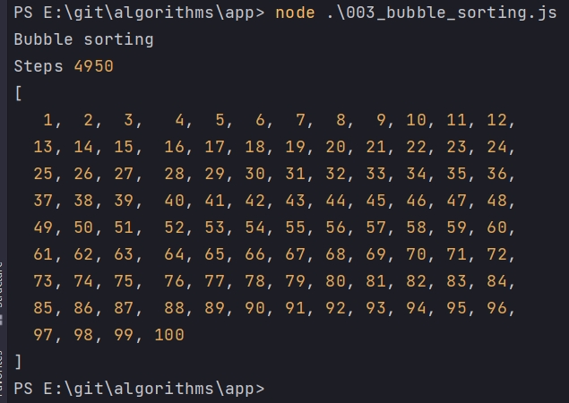

# Пузырьковая сортировка

Создаю функцию bubbleSorting, которая будет принимать массив и его возвращать

```js
console.log(`Bubble sorting`);

const bubbleSorting = (array) => {
  return array;
};

```
По факту нам не нужно мутировать тот массив который мы принимаем

```js
console.log(`Bubble sorting`);

const bubbleSorting = (array) => {
  const arr = [...array]; // Для того что бы не мутировать входящий массив копирую его
  return arr;
};

```

Далее с помощью цикла for прохожусь по массиву

```js
console.log(`Bubble sorting`);

const bubbleSorting = (array) => {
  const arr = [...array]; // Для того что бы не мутировать входящий массив копирую его

  for (let i = 0; i < arr.length - 1; i++) {}

  return arr;
};

```

- 1 для того что бы не выйти за границы массива. Если в краце то массив начинается с нулевого индекса, а итерация по массиву начинается с 1-го шага. По этому что бы остаться на последнем элемента массива необходимо вычесть один шаг итерации. Могу ошибаться.

Теперь реализую функцию swap(менять) - Данная функция берет два элемента, стоящих рядом друг с другом, т.е. под индексом 0 и 1. Сравнивает значения данных элементов. И через промежуточную переменную, если это необходимо, меняет значения данных элементов местами. Если левы элемент больше чем правый, т.е. к примеру индекс 0 имеет значение 5, а индекс 1 имеет значение 3, то значение 5 хранящееся в индексе 0 помещается во временную переменную temp. Далее то что хранится в элементе который нахдится справа, т.е. значение индекса 1 которое равно 3 мы присваиваем индексу 0. 
Значение индекса 0  т.е. 5 теперь перезаписано значением из первого индекса т.е. 3. Но мы окончательно не потеряли значение, которое было до перезаписи так как мы его поместили во временную переменную.
И теперь значение временной переменной присваиваем индексу 1. Таким образом мы меняем значения элементов массива местами.

```js
console.log(`Bubble sorting`);

//меняю элементы местами
const swap = (i, arr) => {
  //arr[i] - левый итерируемый элемент
  //arr[i + 1] - правый итерируемый элемент т.е. i - индекс итерируемого элемента + 1
  if (arr[i] > arr[i + 1]) {
    let temp = arr[i]; // временной переменной переменной присваиваю итерируемый, т.е. левый элемент массива
    arr[i] = arr[i + 1]; // присваиваю значение правого элемента левому
    arr[i + 1] = temp; // значение временной переменной присваиваю правому элементу массива
  }
};

const bubbleSorting = (array) => {
  const arr = [...array]; // Для того что бы не мутировать входящий массив копирую его

  for (let i = 0; i < arr.length - 1; i++) {}

  return arr;
};

```

Теперь в функции bubbleSorting когда я прохожусь по каждому элементу массива мне необходимо вызывать функцию swap. Первым параметром пережаю итерируемый элемент, а вторым передаю сам массив.

```js
console.log(`Bubble sorting`);

//меняю элементы местами
const swap = (i, arr) => {
  //arr[i] - левый итерируемый элемент
  //arr[i + 1] - правый итерируемый элемент т.е. i - индекс итерируемого элемента + 1
  if (arr[i] > arr[i + 1]) {
    let temp = arr[i]; // временной переменной переменной присваиваю итерируемый, т.е. левый элемент массива
    arr[i] = arr[i + 1]; // присваиваю значение правого элемента левому
    arr[i + 1] = temp; // значение временной переменной присваиваю правому элементу массива
  }
};

const bubbleSorting = (array) => {
  const arr = [...array]; // Для того что бы не мутировать входящий массив копирую его

  for (let i = 0; i < arr.length - 1; i++) {
    swap(i, arr);
  }

  return arr;
};
const data = [5, 4, 3, 2, 1];
console.log(bubbleSorting(data));

```


И теперь что мы видим? Пятерка которая хранилась в нулевом индексе массива, теперь находится в самом конце массива в 4 индексе. Т.е. мы за один цикл прохождения по массиву переместили значение нулевого индекса, которое равнялось 5, в самый конец массива.

```js
console.log(`Bubble sorting`);

//меняю элементы местами
const swap = (i, arr) => {
  //arr[i] - левый итерируемый элемент
  //arr[i + 1] - правый итерируемый элемент т.е. i - индекс итерируемого элемента + 1
  if (arr[i] > arr[i + 1]) {
    let temp = arr[i]; // временной переменной переменной присваиваю итерируемый, т.е. левый элемент массива
    arr[i] = arr[i + 1]; // присваиваю значение правого элемента левому
    arr[i + 1] = temp; // значение временной переменной присваиваю правому элементу массива
  }
};

const bubbleSorting = (array) => {
  const arr = [...array]; // Для того что бы не мутировать входящий массив копирую его

  for (let i = 0; i < arr.length - 1; i++) {
    swap(i, arr);
  }
  for (let i = 0; i < arr.length - 1; i++) {
    swap(i, arr);
  }
  for (let i = 0; i < arr.length - 1; i++) {
    swap(i, arr);
  }
  for (let i = 0; i < arr.length - 1; i++) {
    swap(i, arr);
  }

  return arr;
};
const data = [5, 4, 3, 2, 1];
console.log(bubbleSorting(data));

```


Здесь существует две проблемы. 

1. Мы постоянно дублируем код.
2. Массив может быть не известной нам длинным и мы не знаем сколько сколько проходов нам нужно по массиву.

Для того что бы избежать дублирование кода мне нужно сделать цикл в цикле.

Еще один момент. Элементов в массиве у нас пять. А циклов 4. Т.е. для того что бы не выйти за рамки массива, мне нужно делать на одну итерацию меньше.

```js
console.log(`Bubble sorting`);

//меняю элементы местами
const swap = (i, arr) => {
  //arr[i] - левый итерируемый элемент
  //arr[i + 1] - правый итерируемый элемент т.е. i - индекс итерируемого элемента + 1
  if (arr[i] > arr[i + 1]) {
    let temp = arr[i]; // временной переменной переменной присваиваю итерируемый, т.е. левый элемент массива
    arr[i] = arr[i + 1]; // присваиваю значение правого элемента левому
    arr[i + 1] = temp; // значение временной переменной присваиваю правому элементу массива
  }
};

const bubbleSorting = (array) => {
  const arr = [...array]; // Для того что бы не мутировать входящий массив копирую его

  for (let j = 0; j < arr.length - 1; j++) {
    for (let i = 0; i < arr.length - 1; i++) {
      swap(i, arr);
    }
  }

  return arr;
};
const data = [5, 4, 3, 2, 1];
console.log(bubbleSorting(data));

```


Теперь уменьшу количество шагов. Т.е. в тот момент когда правый элемент массива становится больше, не нужно дальше производить итерации и сравнивать элементы. Это делается во внутреннем цикле for, а именно кода мы пробегаемя по длинне массива, в тот момент кода правый элемент становится больше левого, мне нужно на текущей итерации откинуть все элементы массива находящиеся справа. А именно это будет -j.

```js
console.log(`Bubble sorting`);

//меняю элементы местами
const swap = (i, arr) => {
  //arr[i] - левый итерируемый элемент
  //arr[i + 1] - правый итерируемый элемент т.е. i - индекс итерируемого элемента + 1
  if (arr[i] > arr[i + 1]) {
    let temp = arr[i]; // временной переменной переменной присваиваю итерируемый, т.е. левый элемент массива
    arr[i] = arr[i + 1]; // присваиваю значение правого элемента левому
    arr[i + 1] = temp; // значение временной переменной присваиваю правому элементу массива
  }
};

const bubbleSorting = (array) => {
  const arr = [...array]; // Для того что бы не мутировать входящий массив копирую его
  let step = 0; //количество шагов
  for (let j = 0; j < arr.length - 1; j++) {
    for (let i = 0; i < arr.length - 1 - j; i++) {
      swap(i, arr);
      step++; // увеличиваю шаг
    }
  }
  console.log("Steps", step);
  return arr;
};
const data = [5, 4, 3, 2, 1];
console.log(bubbleSorting(data));

```


Количество шагов это длинна массива -1 т.е. arr.length -1 возведенное в квадрат. Это если в алгоритме нет оптимизации шагов.

```js
console.log(`Bubble sorting`);

//меняю элементы местами
const swap = (i, arr) => {
  //arr[i] - левый итерируемый элемент
  //arr[i + 1] - правый итерируемый элемент т.е. i - индекс итерируемого элемента + 1
  if (arr[i] > arr[i + 1]) {
    let temp = arr[i]; // временной переменной переменной присваиваю итерируемый, т.е. левый элемент массива
    arr[i] = arr[i + 1]; // присваиваю значение правого элемента левому
    arr[i + 1] = temp; // значение временной переменной присваиваю правому элементу массива
  }
};

const bubbleSorting = (array) => {
  const arr = [...array]; // Для того что бы не мутировать входящий массив копирую его
  let step = 0; //количество шагов
  for (let j = 0; j < arr.length - 1; j++) {
    for (let i = 0; i < arr.length - 1 - j; i++) {
      swap(i, arr);
      step++; // увеличиваю шаг
    }
  }
  console.log("Steps", step);
  return arr;
};
const data = [...Array(100)].map((_, i, arr) => {
  return arr.length - i;
});
console.log(bubbleSorting(data));

```



